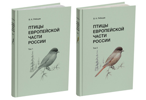
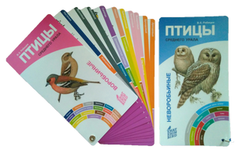

# EkaterinBird

 Проект популяризации бёрдвотчинга, как основы развития интереса и бережного отношения к местному биоразнообразию. 
 В наших планах выпуск компактных справочников-определителей по местному биоразнообразию (не только по птицам), настенных плакатов для школ, установка информационных стендов в зеленых зонах Екатеринбурга и загородных природных парках, создание интерактивного портала для любителей птиц, обучение гидов-орнитологов. И, конечно же, орнитологические экскурсии в Екатеринбурге и окрестностях. Присоединяйтесь к нам в соцсетях:

Вконтакте [vk.com/birdwatching_ekb](https://vk.com/birdwatching_ekb)

Фейсбуке [facebook.com/groups/birdwatchingekb](https://www.facebook.com/groups/birdwatchingekb/)

Инстаграме [instagram.com/birdwatching_ekb](https://www.instagram.com/birdwatching_ekb/)

Телеграме [@birdwatching_ekb](https://t.me/birdwatching_ekb), чтобы быть в курсе самых интересных проектов!
## Орнитологические экскурсии
С 2014 г. мы регулярно проводили орнитологические экскурсии для горожан в парках Екатеринбурга. Анонсы экскурсий публикуются на [TimePad](https://birdwatching-ekb.timepad.ru/). 

Самое время отправиться на орнитологическую экскурсию и узнать, что за птицы живут рядом с вами в парке, дворе, саду или лесу. 
Чтобы получать уведомления о планируемых экскурсиях сообщества - подпишитесь на нашу рассылку в ВК:

<!-- VK Widget -->

Наблюдения за птицами актуальны в любое время года, но сезон организованных городских экскурсий - очень короткий и сильно зависит от погоды, поэтому заранее планировать групповые экскурсии практически невозможно. Предлагаем вам организовать себе и близким птичью прогулку, тогда и в такой компании, в которой для вас это будет комфортно и безопасно. Вы можете собрать свою компанию и пригласить гида-орнитолога провести экскурсию там, где вы любите гулять на природе. Для этого достаточно заполнить [форму](https://docs.google.com/forms/d/e/1FAIpQLSfBjglNFXNIiM3PgCj8j3owcN4pAAW_wxfBh132QuZQqtrn_g/viewform?usp=sf_link), мы договоримся и приедем. 
## Определители птиц
 
 
 
Благодаря [краудфандингу](https://planeta.ru/campaigns/birds_of_ekb) в 2020 г. нам удалось собрать средства на издание карманного веера-определителя наиболее распространенных уральских (и не только) птиц с авторскими иллюстрациями выдающегося орнитолога профессора Вадима Константиновича Рябицева, а также принять участие в издании его очередного полного двухтомного определителя "Птицы Европейской части России", в котором приведены подробные описания и рисунки более 530 видов птиц, зарегистрированных на территории всей Европейской России, включая Калининградскую область на западе и весь Урал на востоке, от Кавказа на юге до Земли Франца-Иосифа на севере. 

Для заказа компактного веера-определителя "Птицы Среднего Урала" заполните [форму](https://docs.google.com/forms/d/e/1FAIpQLSf_hJ6eiLmlaTkPGtsfDUShHwdjIBPALDEWmNPmgiJjvKLHbw/viewform?usp=sf_link).

Для заказа двухтомника В.К. Рябицева "Птицы Европейской части России" заполните [форму](https://docs.google.com/forms/d/e/1FAIpQLScW9jk1ZzQoqhlJiWle05DhM99wAIimJT4mxp5ncP76OQLyPA/viewform?usp=sf_link).

На Среднем Урале в пределах Свердловской области и Пермского края можно встретить более 250 видов птиц. В издание включено 102 вида самых обычных и заметных птиц этой территории. В орнитологии принято делить всех птиц на две большие группы - неворобьиных и воробьиных. К неворобьиным относятся представители разных отрядов. Они изображены на одной стороне веера-определителя. На другой стороне изображены воробьиные - представители одного отряда Воробьеобразных - главным образом мелких певчих птиц.

Рисунки, использованные в этом издании распространяются с авторской лицензией Creative Commons 

[Скачать определитель в формате pdf](https://ipae.uran.ru/sites/default/files/publications/ipae/1325_2020_Ryabitsev.pdf)

  

## Определитель бабочек

В 2021 г. мы планируем продолжить издание серии вееров-определителей по уральской фауне и флоре. Открыт предзаказ на веер-определитель "Бабочки Среднего Урала" П.Ю. Горбунова.
Для предзаказа заполните [форму](https://docs.google.com/forms/d/e/1FAIpQLSeav_J9mhW49-W4HY9HdKGoivPjdEhc4ab5xfHlDEIE2EjmDg/viewform?usp=sf_link)
 
